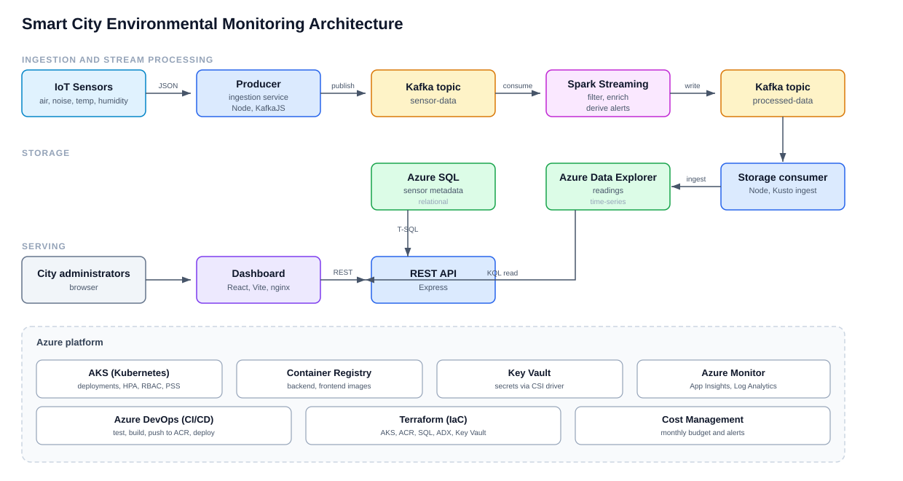
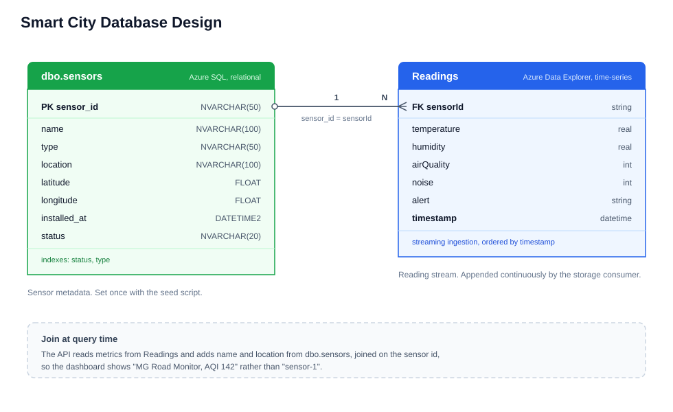

# Smart City — Environmental Monitoring (Backend)

A distributed backend that ingests real-time IoT environmental data (air quality,
noise, temperature, humidity), processes the stream, stores it in a time-series
database, and serves aggregated metrics over a REST API.

> Phase 1 (this repo): local backend. Cloud/Azure deployment (AKS, Key Vault,
> CI/CD, IaC, monitoring) is planned for Phase 2.

## Architecture



Data flow: Sensors → Kafka `sensor-data` → Processor (filter/enrich/alert) →
Kafka `processed-data` → Storage → Azure Data Explorer (time-series) → REST API.

### Microservices

| Service       | File                    | Role                                              |
|---------------|-------------------------|---------------------------------------------------|
| Ingestion     | `backend/producer/producer.js`  | Simulates sensors, publishes to `sensor-data`     |
| Stream proc. | `backend/spark/stream.py` | Apache Spark Structured Streaming — filters/enriches readings, adds alerts |
| Storage       | `backend/consumer/consumer.js`  | Persists processed readings to Azure Data Explorer |
| API           | `backend/server.js`     | REST API for latest data, summaries, alerts       |
| Topic setup   | `backend/admin.js`      | Creates Kafka topics (one-shot)                   |

### Why these choices

- Kafka (KRaft mode): decouples producers from consumers, buffers bursts,
  and lets each stage scale independently. KRaft removes the legacy Zookeeper.
- Apache Spark Structured Streaming: the recommended engine for real-time
  filtering, aggregation, and enrichment at scale. Reads from Kafka, derives
  per-reading alerts, and writes back to Kafka.
- Azure Data Explorer (time-series): the Azure-native time-series database
  for high-write, timestamped IoT data. Streaming ingestion keeps the dashboard
  near real time, and KQL drives the aggregation/alert queries.
- Azure SQL (relational): stores slow-changing sensor metadata (name,
  type, location, coordinates, status). Keeping metadata relational and readings
  time-series is the standard split for write-heavy IoT; the API joins the two so
  dashboards show "AQI 142 at MG Road" instead of just "sensor-1".

### Database design



## Run with Docker (recommended)

Brings up Kafka and all services together. The time-series store is Azure Data
Explorer (cloud), so first copy `.env.example` to `.env` and set the `KUSTO_*` /
`AAD_*` values, and create the table once by running `backend/db/adx-schema.kql` against
your ADX database:

```bash
docker compose up --build
```

The `topic-setup` service creates the Kafka topics automatically, then the
producer → Spark processor → storage pipeline starts and the API is exposed
on `http://localhost:3000`.

> On first run the Spark service downloads the Spark–Kafka connector jars
> (~60–90s) before it begins streaming. This is normal.

## Run locally (without Docker)

Start Kafka (e.g. `docker compose up kafka`), then in separate terminals:

```bash
npm install
npm run topics      # create Kafka topics (once)
npm run producer    # generate sensor data
npm run storage     # persist to Azure Data Explorer
npm run api         # REST API on :3000
```

For the stream processing step, run the Spark job:

```bash
docker compose up spark-processor
```

### Configuration (environment variables)

| Variable               | Default                              | Used by            |
|------------------------|--------------------------------------|--------------------|
| `KAFKA_BROKERS`        | `localhost:29092`                    | all Kafka services |
| `KUSTO_QUERY_URI`      | —                                    | storage, api       |
| `KUSTO_DATABASE`       | `smartcity`                          | storage, api       |
| `AAD_APP_ID` / `AAD_APP_KEY` / `AAD_TENANT_ID` | —                  | storage, api (only to force app auth) |
| `API_PORT`             | `3000`                               | api                |
| `PRODUCE_INTERVAL_MS`  | `2000`                               | producer           |
| `TOPIC_RAW`            | `sensor-data`                        | all                |
| `TOPIC_PROCESSED`      | `processed-data`                     | all                |
| `SQL_SERVER`           | `localhost`                          | api, seed          |
| `SQL_DATABASE`         | `smartcity`                          | api, seed          |
| `SQL_USER` / `SQL_PASSWORD` | —                               | api, seed          |

Copy `.env.example` to `.env` and fill in the Azure SQL values (`.env` is
git-ignored). Then create + seed the relational metadata table once:

```bash
npm run seed
```

## REST API

| Method | Endpoint                         | Description                                |
|--------|----------------------------------|--------------------------------------------|
| GET    | `/health`                        | Service + DB health (ADX + Azure SQL)      |
| GET    | `/api/sensors`                   | Sensor metadata from Azure SQL (relational)|
| GET    | `/api/sensor?sensorId=&limit=`   | Latest readings (optionally per sensor)    |
| GET    | `/api/sensor/latest`             | Most recent reading per sensor, enriched with metadata |
| GET    | `/api/metrics/summary?minutes=`  | Average metrics per sensor over a window   |
| GET    | `/api/alerts?limit=`             | Recent non-normal alerts                   |

Example:

```bash
curl http://localhost:3000/api/metrics/summary?minutes=10
```

## Frontend dashboard

A React (Vite) dashboard in `frontend/` shows live per-sensor cards (with
location from Azure SQL), an AQI trend chart, and an alerts table. It's
containerized (nginx) and part of the compose stack:

```bash
docker compose up --build          # dashboard at http://localhost:8080
# or for development:
cd frontend && npm install && npm run dev   # http://localhost:5173
```

## Tests

```bash
npm test          # node:test — alert classification unit tests
```

## Kubernetes (AKS-ready)

Full manifests in `k8s/` — Deployments, Services, ConfigMap/Secret, resource
limits, HPA autoscaling, RBAC, and Pod Security Standards. Deploy
locally (Docker Desktop K8s / kind) or to AKS:

```bash
kubectl apply -k k8s/
```

See `k8s/README.md` for the full local + AKS walkthrough.

## CI/CD

- `azure-pipelines.yml` — Azure DevOps pipeline: test → build → push images to
  Azure Container Registry (ACR) → deploy to AKS with staging/production approval
  gates (via Environments).

## Infrastructure as Code

`terraform/` provisions the whole Azure footprint (AKS, ACR, Azure SQL, Key
Vault, Log Analytics, App Insights, Monitor alerts, Cost budget):

```bash
cd terraform
export TF_VAR_sql_admin_password='<password>'
terraform init && terraform validate && terraform plan
terraform apply        # provision (billable)   ·   terraform destroy  # ~$0
```

## Security & operations

- Secrets: Azure Key Vault (`backend/db/keyvault.js`; set `KEYVAULT_NAME`). On
  AKS, the Secrets Store CSI driver mounts them (`k8s/secrets.yaml`).
- Monitoring: Application Insights auto-instruments the API (set
  `APPLICATIONINSIGHTS_CONNECTION_STRING`); logs go to Log Analytics.
- Cost: an Azure budget with email alerts (Terraform + `terraform/`).

## Documentation

- `docs/PROJECT_REPORT.md` - full report (requirements, architecture, design).

## Message format

`sensor-data` (raw) and `processed-data` (enriched) messages:

```json
{
  "sensorId": "sensor-1",
  "temperature": 27.4,
  "humidity": 58,
  "airQuality": 142,
  "noise": 73,
  "timestamp": "2026-06-13T10:00:00.000Z",
  "alert": "MODERATE POLLUTION",
  "processedAt": "2026-06-13T10:00:00.120Z"
}
```

## Tech stack

Node.js 24 · Express 5 · KafkaJS · Confluent Kafka (KRaft, no Zookeeper) ·
Apache Spark 3.5 (Structured Streaming) · Azure Data Explorer (time-series,
`azure-kusto-data`/`azure-kusto-ingest`) · Azure SQL (relational metadata,
`mssql` driver) · Docker Compose.
